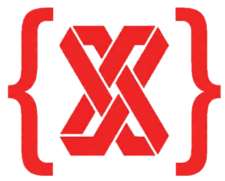

**Modern, low-touch schema migration and management. Git- and CI/CD-friendly. Full or governance-only.**

[](https://opensource.org/licenses/Apache-2.0)

SchemaX is a modern, low-touch, interactive schema migration and management tool for data catalogs. It's Git- and CI/CD-friendly: design schemas in the VS Code designer or define them in code, store changes as versioned operations and snapshots, and generate or apply SQL per environment. Use it in **full mode** (create and manage catalogs, schemas, tables, and governance) or **governance-only mode** (comments, tags, grants, row filters, column masks on existing objects). Unity Catalog is supported today; Hive and PostgreSQL are planned.

**Current Support:** Databricks Unity Catalog (v1.0) | **Coming Soon:** Hive Metastore, PostgreSQL/Lakebase

## Features

### 🎨 Visual Schema Designer (VS Code Extension)
- Intuitive drag-and-drop interface for schema modeling
- **Provider-based**: Unity Catalog (now), Hive/PostgreSQL (coming soon)
- Adapts to provider-specific hierarchy and features
- **Dependency-aware views and materialized views**: Creation order is derived from your SQL (tables → views → MVs); you can also edit dependencies manually in the Designer (automatic FQN qualification)
- Data governance features (constraints, tags, row filters, column masks)
- External table support with named locations per environment
- Partitioning and liquid clustering support
- Snapshot-based versioning with semantic versions
- Real-time SQL generation from changes

### 🐍 Python SDK & CLI
- Command-line tools for automation and CI/CD
- Python API for custom workflows
- Provider-aware SQL migration generation with **dependency-aware ordering**
- **View dependency extraction and automatic FQN qualification**
- **Deployment tracking with database-backed audit trail**
- **Automatic and manual rollback capabilities**
- **Snapshot lifecycle management (create, validate, rebase)**
- Schema validation with circular dependency detection and stale snapshot detection

### 🚀 Key Capabilities
- **Extensible Provider System**: Easy to add new catalog types
- **50+ Operation Types**: Complete coverage of Unity Catalog DDL (tables, views, volumes, functions, materialized views, governance)
- **Dependency-Aware SQL Generation**: Views and materialized views are created in the correct order based on extracted or manually edited dependencies; topological sorting with circular dependency detection
- **Dual Implementation**: TypeScript (VS Code) + Python (CLI/SDK)
- **SQL Generation**: Provider-specific, idempotent DDL with automatic FQN qualification
- **Version Control**: Git-friendly JSON format with snapshots
- **CI/CD Ready**: Integrate with GitHub Actions, GitLab CI, etc.

### 🔌 Supported Providers

| Provider | Status | Hierarchy | Features |
|----------|--------|-----------|----------|
| **Unity Catalog** | ✅ Available (v1.0) | Catalog → Schema → Table/View/Volume/Function/MV | Full governance (views, volumes, functions, materialized views, constraints, tags, filters, masks, external tables) |
| **Hive Metastore** | 🔜 Coming Soon | Database → Table | Tables, partitions, views |
| **PostgreSQL** | 🔜 Coming Soon | Database → Schema → Table | Tables, indexes, constraints, views |

**For Provider Developers:** See the [documentation site](docs/schemax/) — **For Contributors** → [Provider contract](docs/schemax/docs/reference/provider-contract.mdx).

## Quick Start

### VS Code Extension

**Node:** Node 18+ is required. If you see Jest engine warnings during `npm install`, they are harmless; use Node 20 or 22 to avoid them.

1. **Launch Extension Development Host**:
   ```bash
   cd schemax-vscode
   code .
   # Press F5 (or Fn+F5)
   ```

2. **In the new window**:
   - Press `Cmd+Shift+P` (Mac) or `Ctrl+Shift+P` (Windows/Linux)
   - Type: **SchemaX: Open Designer**
   - Start designing your schema!

3. **Generate SQL**:
   - After making changes
   - Press `Cmd+Shift+P`
   - Type: **SchemaX: Generate SQL Migration**

### Python CLI

1. **Install**:
   ```bash
   cd packages/python-sdk
   pip install -e .
   ```

2. **Use CLI**:
   ```bash
   # Initialize new project with provider
   schemax init --provider unity
   
   # Validate schema files
   schemax validate
   
   # Create a snapshot
   schemax snapshot create --name "Initial schema" --version v0.1.0
   
   # Generate SQL migration
   schemax sql --output migration.sql --target dev
   
   # Apply schema changes to environment
   schemax apply --target dev --profile DEFAULT --warehouse-id <id>
   
   # Apply with automatic rollback on failure
   schemax apply --target dev --profile DEFAULT --warehouse-id <id> --auto-rollback
   
   # Rollback a failed deployment (partial)
   schemax rollback --partial --deployment <id> --target dev --profile DEFAULT --warehouse-id <id>
   
   # Rollback to a previous snapshot (complete)
   schemax rollback --to-snapshot v0.2.0 --target dev --profile DEFAULT --warehouse-id <id>
   
   # Validate snapshots after git rebase
   schemax snapshot validate
   
   # Rebase a stale snapshot
   schemax snapshot rebase v0.3.0
   ```

3. **Python API**:
   ```python
   from pathlib import Path
   from schemax.core.storage import load_current_state
   from schemax.providers.base.operations import Operation
   
   # Load with provider
   state, changelog, provider = load_current_state(Path.cwd())
   
   # Generate SQL using provider
   operations = [Operation(**op) for op in changelog["ops"]]
   generator = provider.get_sql_generator(state)
   sql = generator.generate_sql(operations)
   print(sql)
   ```

## Deployment & Rollback ✨ NEW

SchemaX provides robust deployment tracking and rollback capabilities for safe schema migrations:

### 🚀 Apply Command
Deploy schema changes with confidence:
- **Interactive snapshot prompts** - Create snapshots before deployment
- **SQL preview** - Review all changes before execution  
- **Database-backed tracking** - Audit trail in `{catalog}.schemax` schema
- **Auto-rollback option** - Automatically revert on failure (`--auto-rollback`)
- **Dry-run mode** - Test without making changes (`--dry-run`)

```bash
schemax apply --target dev --profile DEFAULT --warehouse-id <id> --auto-rollback
```

### ⏪ Rollback Command
Recover from failed deployments:

**Partial Rollback** - Revert successful operations from a failed deployment:
```bash
schemax rollback --partial --deployment <id> --target dev --profile DEFAULT --warehouse-id <id>
```

**Complete Rollback** - Rollback to a previous snapshot:
```bash
schemax rollback --to-snapshot v0.2.0 --target dev --profile DEFAULT --warehouse-id <id>
```

Both support:
- **Safety validation** - Classifies operations as SAFE, RISKY, or DESTRUCTIVE
- **State-based diffing** - Uses state_differ for accurate rollback operations
- **Dry-run mode** - Preview rollback SQL without executing

### 📸 Snapshot Management
Manage schema versions after Git operations:

```bash
# Create snapshot manually
schemax snapshot create --name "Production release" --version v1.0.0

# Detect stale snapshots after git rebase
schemax snapshot validate

# Rebase snapshot onto new base
schemax snapshot rebase v0.3.0
```

**Features:**
- Validates snapshot lineage after Git rebases
- Unpacks and replays changes on new base
- Detects conflicts and prompts for manual resolution via UI
- Semantic versioning (MAJOR.MINOR.PATCH)

## Documentation

| Document | Description |
|----------|-------------|
| **[Documentation site](docs/schemax/)** | **Single source:** Quickstart, Architecture, Workflows, CLI, Development, Testing, Provider contract, Contributing. Run `cd docs/schemax && npm run start` to browse locally. |
| **[VS Code Extension](packages/vscode-extension/README.md)** | Extension-specific documentation |
| **[Python SDK](packages/python-sdk/README.md)** | SDK and CLI reference |

## Repository Structure

```
schemax/
├── packages/
│   ├── vscode-extension/       # VS Code Extension (TypeScript + React)
│   │   ├── src/
│   │   │   ├── providers/            # Provider system (V4)
│   │   │   │   ├── base/             # Base interfaces
│   │   │   │   ├── unity/            # Unity Catalog provider
│   │   │   │   └── registry.ts       # Provider registry
│   │   │   ├── storage-v4.ts         # Multi-environment storage
│   │   │   ├── extension.ts          # Extension commands
│   │   │   └── webview/              # React UI
│   │   └── package.json
│   │
│   └── python-sdk/             # Python SDK & CLI
│       ├── src/schemax/
│       │   ├── providers/            # Provider system (V4)
│       │   │   ├── base/             # Base interfaces
│       │   │   ├── unity/            # Unity Catalog provider
│       │   │   └── registry.py       # Provider registry
│       │   ├── commands/             # Command modules
│       │   ├── storage_v4.py         # Multi-environment storage
│       │   └── cli.py                # CLI routing layer
│       └── pyproject.toml
│
├── examples/                   # Working examples
│   ├── basic-schema/          # Sample project
│   ├── github-actions/        # CI/CD templates
│   └── python-scripts/        # SDK usage examples
│
├── docs/                       # Documentation
│   ├── README.md              # Points to Docusaurus site
│   └── schemax/               # Docusaurus site (single source for all docs)
│
├── scripts/                    # Development scripts
│   └── smoke-test.sh          # Quick validation
│
└── .github/workflows/          # CI/CD
    ├── extension-ci.yml
    ├── python-sdk-ci.yml
    └── integration-tests.yml
```

## How It Works

### 1. Design Schema

Use the VS Code visual designer or directly edit `.schemax/` files:

```
.schemax/
├── project.json          # Project metadata
├── changelog.json        # Uncommitted operations
└── snapshots/
    └── v*.json          # Version snapshots
```

### 2. Track Changes

Every modification generates a provider-prefixed operation:
```json
{
  "id": "op_abc123",
  "ts": "2025-10-13T12:00:00Z",
  "provider": "unity",
  "op": "unity.add_column",
  "target": "col_001",
  "payload": {
    "tableId": "table_001",
    "colId": "col_001",
    "name": "customer_id",
    "type": "BIGINT",
    "nullable": false
  }
}
```

### 3. Generate SQL

Convert operations to provider-specific SQL DDL:
```sql
-- Operation: unity.add_column (op_abc123)
-- Timestamp: 2025-10-13T12:00:00Z
ALTER TABLE `main`.`sales`.`customers` 
ADD COLUMN `customer_id` BIGINT NOT NULL;
```

### 4. Deploy

Execute SQL on Databricks and track deployment:
```bash
# Generate SQL
schemax sql --environment prod --output deploy.sql

# Execute on Databricks
databricks sql execute --file deploy.sql --warehouse-id <id>

# Track deployment
schemax deploy --environment prod --version v1.0.0 --mark-deployed
```

## Unity Catalog Support

SchemaX supports all major Unity Catalog features:

### Core Objects
- ✅ Catalogs (CREATE, ALTER, DROP, MANAGED LOCATION)
- ✅ Schemas (CREATE, ALTER, DROP, MANAGED LOCATION)
- ✅ Tables (CREATE, ALTER, DROP)
  - **Managed tables** (recommended) - Unity Catalog manages both metadata and data
  - **External tables** - Reference data in external locations (S3, ADLS, GCS)
  - Delta and Iceberg formats
  - Column mapping modes
  - Partitioning (`PARTITIONED BY`)
  - Liquid Clustering (`CLUSTER BY`)
- ✅ Columns (ADD, RENAME, ALTER TYPE, DROP)
- ✅ **Volumes** (CREATE [EXTERNAL] VOLUME, ALTER, DROP) – managed or external storage for files
- ✅ **Functions** (CREATE OR REPLACE FUNCTION, DROP) – SQL and Python UDFs
- ✅ **Materialized Views** (CREATE MATERIALIZED VIEW, ALTER, REFRESH, DROP) – precomputed query results

### Data Governance
- ✅ **Constraints**: PRIMARY KEY, FOREIGN KEY, CHECK
- ✅ **Column Tags**: Key-value metadata for classification
- ✅ **Row Filters**: Row-level security with UDF expressions
- ✅ **Column Masks**: Data masking functions
- ✅ **Table Properties**: TBLPROPERTIES for Delta Lake configuration

### Multi-Environment Support
- ✅ **Logical Isolation**: Map logical catalog names to physical names per environment
- ✅ **Physical Isolation**: Configure managed locations for catalogs/schemas per environment
- ✅ **External Locations**: Define named external locations with environment-specific paths
- ✅ **Environment-Specific SQL**: Generate SQL with resolved catalog names and locations

### Example Schema

```typescript
{
  "catalogs": [{
    "name": "main",
    "schemas": [{
      "name": "sales",
      "tables": [{
        "name": "customers",
        "format": "delta",
        "columns": [
          {
            "name": "customer_id",
            "type": "BIGINT",
            "nullable": false,
            "comment": "Primary key"
          },
          {
            "name": "email",
            "type": "STRING",
            "nullable": false,
            "tags": {
              "PII": "sensitive",
              "category": "contact"
            }
          }
        ],
        "constraints": [{
          "type": "primary_key",
          "name": "pk_customers",
          "columns": ["col_001"]
        }],
        "properties": {
          "delta.enableChangeDataFeed": "true"
        }
      }]
    }]
  }]
}
```

## CI/CD Integration

### GitHub Actions Example

```yaml
name: Deploy Schema
on:
  push:
    branches: [main]

jobs:
  deploy:
    runs-on: ubuntu-latest
    steps:
      - uses: actions/checkout@v3
      
      - uses: actions/setup-python@v4
        with:
          python-version: '3.11'
      
      - name: Install SchemaX
        run: pip install schemaxpy
      
      - name: Validate Schema
        run: schemax validate
      
      - name: Generate SQL
        run: schemax sql --environment prod --output migration.sql
      
      - name: Deploy to Databricks
        env:
          DATABRICKS_HOST: ${{ secrets.DATABRICKS_HOST }}
          DATABRICKS_TOKEN: ${{ secrets.DATABRICKS_TOKEN }}
        run: |
          databricks sql execute \
            --file migration.sql \
            --warehouse-id ${{ secrets.WAREHOUSE_ID }}
```

See [examples/github-actions/](examples/github-actions/) for more templates.

## Quality Checks & CI/CD

### Quick Quality Checks

Run all quality checks locally (formatting + smoke tests):

```bash
./devops/run-checks.sh
```

This will:
- ✅ Check Python code formatting (Black)
- ✅ Run smoke tests (build, install, validate)
- ✅ Report any issues

### CI/CD Pipeline

The project includes automated quality checks via GitHub Actions:
- Code formatting validation
- Smoke tests
- GPG commit signature verification

See [devops/README.md](devops/README.md) for pipeline details.

## Testing

### Quick Smoke Test

```bash
./scripts/smoke-test.sh
```

### Python Tests

```bash
cd packages/python-sdk

# Run all tests
pytest

# Run with coverage
pytest --cov=schemax --cov-report=term-missing

# Run specific test file
pytest tests/unit/test_sql_generator.py -v
```

**Current Status:**
- ✅ 124 passing tests (91.2%)
- ⏸️ 12 skipped tests (documented in [issues #19](https://github.com/vb-dbrks/schemax-vscode/issues/19), [#20](https://github.com/vb-dbrks/schemax-vscode/issues/20))
- Test Coverage: Unit tests, integration tests, provider tests

### Manual Testing

See the [documentation site](docs/schemax/) — **For Contributors** → Testing — for the full testing guide.

### Example Project

```bash
cd examples/basic-schema
schemax validate
schemax sql
```

## Requirements

- **VS Code Extension**: VS Code 1.90.0+
- **Python SDK**: Python 3.11+
- **Databricks**: Unity Catalog-enabled workspace

## Development

### Build VS Code Extension

```bash
cd packages/vscode-extension
npm install
npm run build
```

### Install Python SDK

```bash
cd packages/python-sdk
pip install -e ".[dev]"
```

### Run Tests

```bash
# Quality checks (formatting + smoke tests)
./devops/run-checks.sh

# Smoke test only
./scripts/smoke-test.sh

# Extension build
cd packages/vscode-extension && npm run build

# Python tests
cd packages/python-sdk && pytest

# Python tests with coverage
cd packages/python-sdk && pytest --cov=schemax

# SQL validation (optional - requires SQLGlot)
pip install sqlglot>=20.0.0
```

## Roadmap

### ✅ Completed

**v0.1.0 - Unity Catalog MVP**
- Visual schema designer
- Python SDK & CLI
- SQL generation (TypeScript + Python)
- Deployment tracking
- All 50+ Unity Catalog operation types (incl. volumes, functions, materialized views)
- Examples and documentation

**v0.2.0 - Provider Architecture (Current)**
- ✅ Extensible provider system
- ✅ Provider registry
- ✅ Unity Catalog provider (v1.0)
- ✅ Multi-environment storage (V4)
- ✅ Comprehensive provider documentation
- ✅ Provider development guide

### 🔜 Next (v0.3.0 - Q1 2026)
- [ ] **Hive Metastore provider**
- [ ] **PostgreSQL/Lakebase provider**
- [ ] Provider compliance test suite
- [ ] Dynamic UI components
- ✅ Extended Unity Catalog (volumes, functions, materialized views)

### 🔄 Future
- [ ] Multi-provider projects
- [ ] Databricks Asset Bundle (DAB) generation
- [ ] Schema import from Databricks
- [ ] Drift detection
- [ ] Visual diff viewer
- [ ] Template library
- [ ] Provider marketplace
- [ ] VS Code Marketplace publication
- [ ] PyPI publication

## Contributing

We welcome contributions! See [CONTRIBUTING.md](CONTRIBUTING.md) for guidelines.

## License

Apache License 2.0 - see [LICENSE](LICENSE) for details.

## Support

- **Issues**: [GitHub Issues](https://github.com/vb-dbrks/schemax-vscode/issues)
- **Documentation**: [docs/schemax/](docs/schemax/) (Docusaurus site)
- **Examples**: [examples/](examples/)

---

**SchemaX** - Making data catalog schema management declarative, extensible, and version-controlled. 🚀

**Current**: Unity Catalog | **Coming Soon**: Hive Metastore, PostgreSQL | **Extensible**: Add your own provider!
