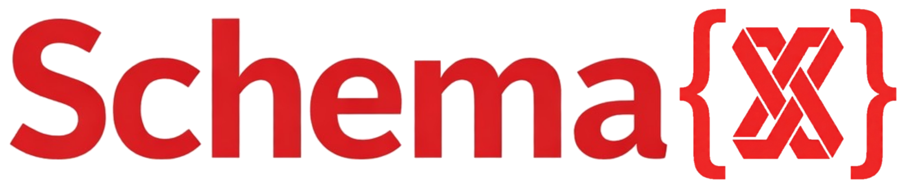

**SchemaX is a Git-friendly schema management platform for data catalogs, with a VS Code designer and a Python CLI/SDK.**

[](https://opensource.org/licenses/Apache-2.0)
[](https://codecov.io/gh/vb-dbrks/schemax-vscode)
[](https://github.com/vb-dbrks/schemax-vscode/actions/workflows/python-sdk-ci.yml)
[](https://github.com/vb-dbrks/schemax-vscode/actions/workflows/extension-ci.yml)
[](https://github.com/vb-dbrks/schemax-vscode/actions/workflows/docs-ci.yml)
[](https://github.com/vb-dbrks/schemax-vscode/actions/workflows/publish-pypi.yml)
[](https://github.com/vb-dbrks/schemax-vscode/actions/workflows/publish-vscode-extension.yml)
[](https://pypi.org/project/schemaxpy/)
[](https://pypi.org/project/schemaxpy/)
[](https://marketplace.visualstudio.com/items?itemName=schematic-dev.schemax-vscode)

## What SchemaX Does

- Models catalog objects and governance as versioned operations + snapshots
- Generates provider-aware SQL with dependency ordering
- Applies changes safely with deployment tracking and rollback flows
- Supports live workflows via CLI and programmable workflows via Python SDK

Current provider depth is Databricks Unity Catalog. Hive support is in progress.

## Documentation

The Docusaurus site is the source of truth for product and engineering docs:

- [Documentation Home](https://vb-dbrks.github.io/schemax/)
- [Quickstart](https://vb-dbrks.github.io/schemax/docs/getting-started/quickstart/)
- [Architecture](https://vb-dbrks.github.io/schemax/docs/architecture/system-overview/)
- [CLI Reference](https://vb-dbrks.github.io/schemax/docs/reference/cli-reference/)
- [Provider Contract](https://vb-dbrks.github.io/schemax/docs/reference/provider-contract/)
- [Testing Guide](https://vb-dbrks.github.io/schemax/docs/contributing/testing/)

Package-level docs:

- [Python SDK README](packages/python-sdk/README.md)
- [VS Code Extension README](packages/vscode-extension/README.md)

## Quick Start

### VS Code Extension

```bash
cd /Users/varun.bhandary/Documents/side-projects/schemax-vscode
code .
# Press F5 to launch extension host
```

Then run `SchemaX: Open Designer` from the command palette.

### Python CLI

```bash
cd /Users/varun.bhandary/Documents/side-projects/schemax-vscode/packages/python-sdk
pip install -e .
schemax init --provider unity
schemax validate
schemax sql --target dev --output migration.sql
```

## Repository Structure

- `packages/vscode-extension`: VS Code extension (TypeScript + React)
- `packages/python-sdk`: CLI + SDK (Python)
- `docs/schemax`: Docusaurus documentation site
- `examples`: sample projects and CI/CD templates

## Development

```bash
cd /Users/varun.bhandary/Documents/side-projects/schemax-vscode/packages/python-sdk
make ci
```

For live integration tests + coverage upload:

```bash
cd /Users/varun.bhandary/Documents/side-projects/schemax-vscode/packages/python-sdk
make integration
```

## License

Apache 2.0. See [LICENSE](LICENSE).
