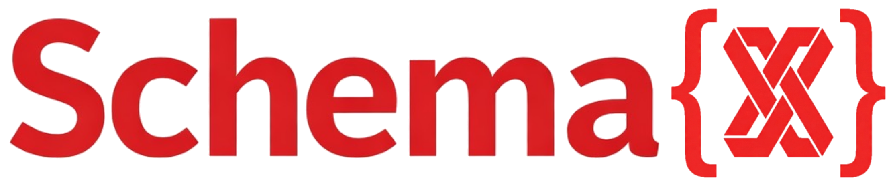

**SchemaX is a Git-friendly schema management platform for data catalogs, with a VS Code designer and a Python CLI/SDK.**

[](https://opensource.org/licenses/Apache-2.0)
[](https://codecov.io/gh/vb-dbrks/schemax)
[](https://github.com/vb-dbrks/schemax-vscode/actions/workflows/python-sdk-ci.yml)
[](https://github.com/vb-dbrks/schemax-vscode/actions/workflows/extension-ci.yml)
[](https://pepy.tech/projects/schemaxpy)

## What SchemaX Does

- Models catalog objects and governance as versioned operations + snapshots
- Generates provider-aware SQL with dependency ordering
- Applies changes safely with deployment tracking and rollback flows
- Supports live workflows via CLI and programmable workflows via Python SDK

Current provider depth is Databricks Unity Catalog. Hive support is in progress.

## Documentation

The Docusaurus site is the source of truth for product and engineering docs:

- [Documentation Home](https://vb-dbrks.github.io/schemax/)
- [Quickstart](https://vb-dbrks.github.io/schemax/docs/getting-started/quickstart/)
- [Architecture](https://vb-dbrks.github.io/schemax/docs/architecture/system-overview/)
- [CLI Reference](https://vb-dbrks.github.io/schemax/docs/reference/cli-reference/)
- [Provider Contract](https://vb-dbrks.github.io/schemax/docs/reference/provider-contract/)
- [Release Notes](https://vb-dbrks.github.io/schemax/docs/reference/release-notes/)
- [Testing Guide](https://vb-dbrks.github.io/schemax/docs/contributing/testing/)

Package-level docs:

- [Python SDK README](packages/python-sdk/README.md)
- [VS Code Extension README](packages/vscode-extension/README.md)

## Quick Start

### Extension (VS Code, Cursor, Antigravity)

Install **SchemaX** from your editor’s marketplace:

- **VS Code** — [Visual Studio Marketplace](https://marketplace.visualstudio.com/items?itemName=schematic-dev.schemax-vscode) (or search **SchemaX** in Extensions).
- **Cursor / Antigravity** — [Open VSX](https://open-vsx.org/extension/schemax/schemax-vscode) (or search **SchemaX** in your editor’s extension view).

Full setup (extension + CLI, open a project): [Setup guide](https://vb-dbrks.github.io/schemax/docs/guide/setup/).

### Python CLI

```bash
pip install schemaxpy
```

Install from [PyPI](https://pypi.org/project/schemaxpy/). Then read [Quickstart](https://vb-dbrks.github.io/schemax/docs/guide/quickstart/) or the [CLI reference](https://vb-dbrks.github.io/schemax/docs/reference/cli-reference/).
## License

Apache 2.0. See [LICENSE](LICENSE).
