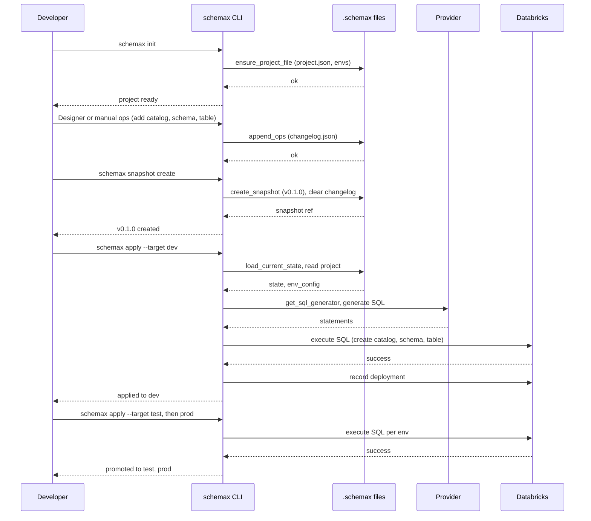
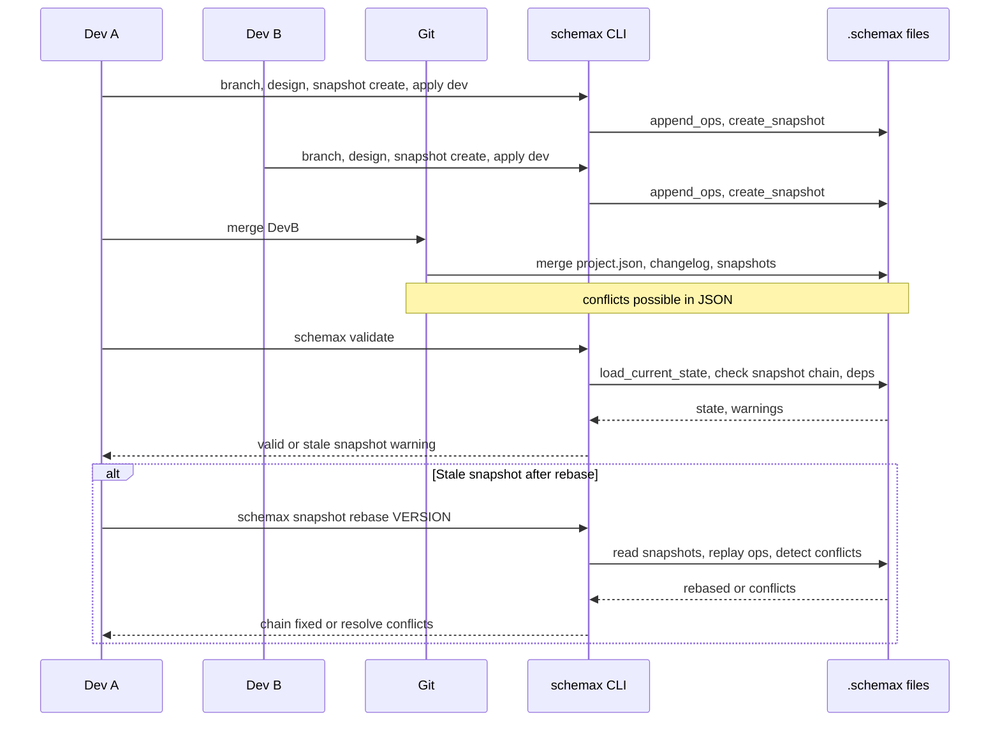
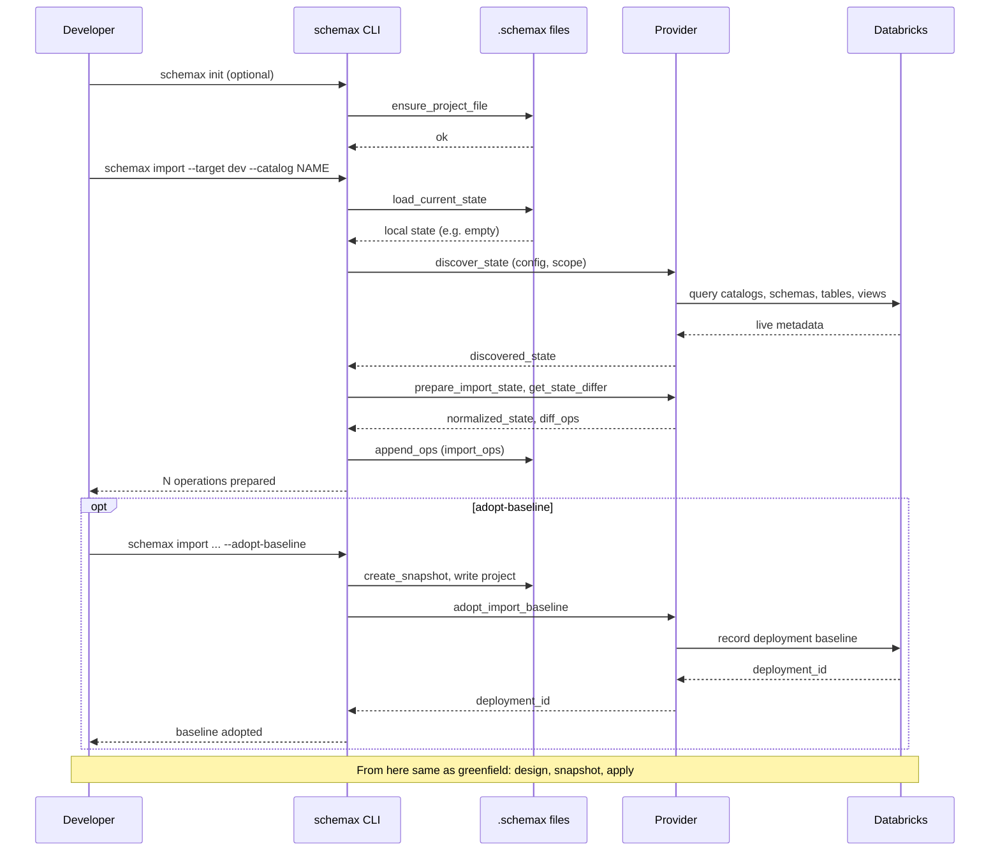
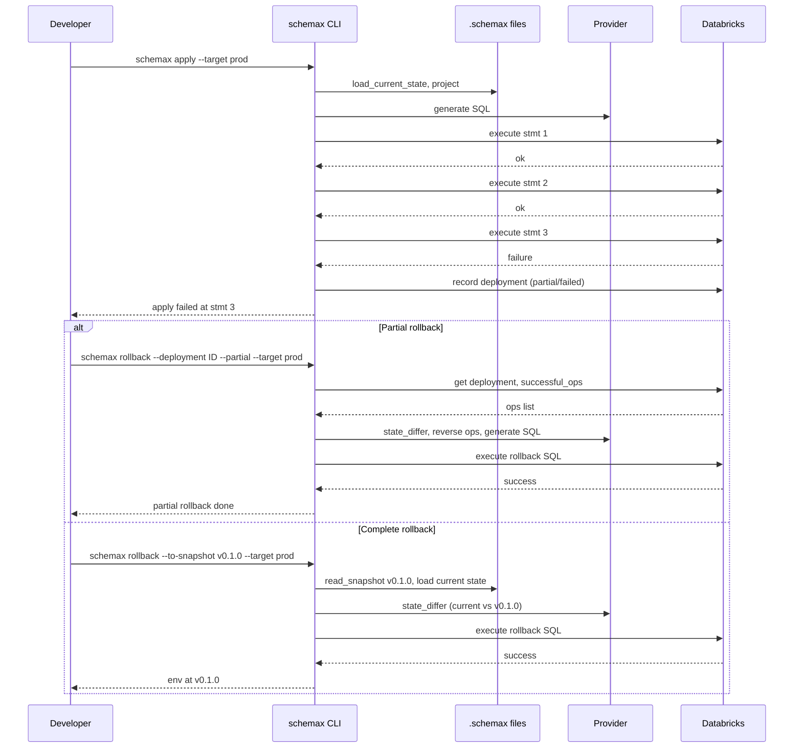
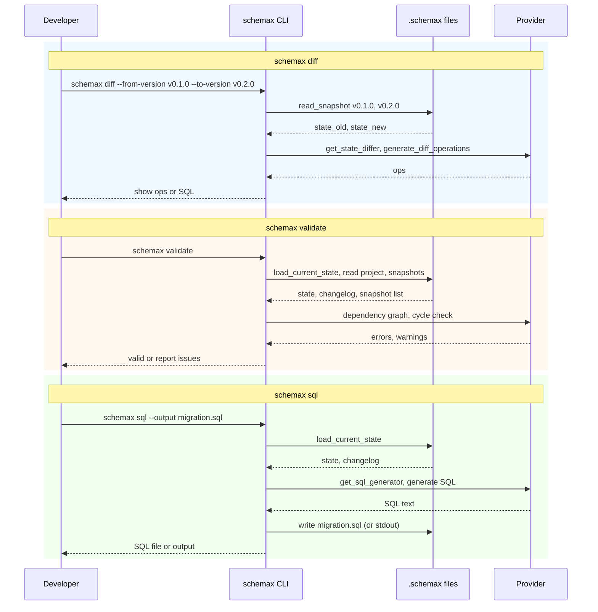
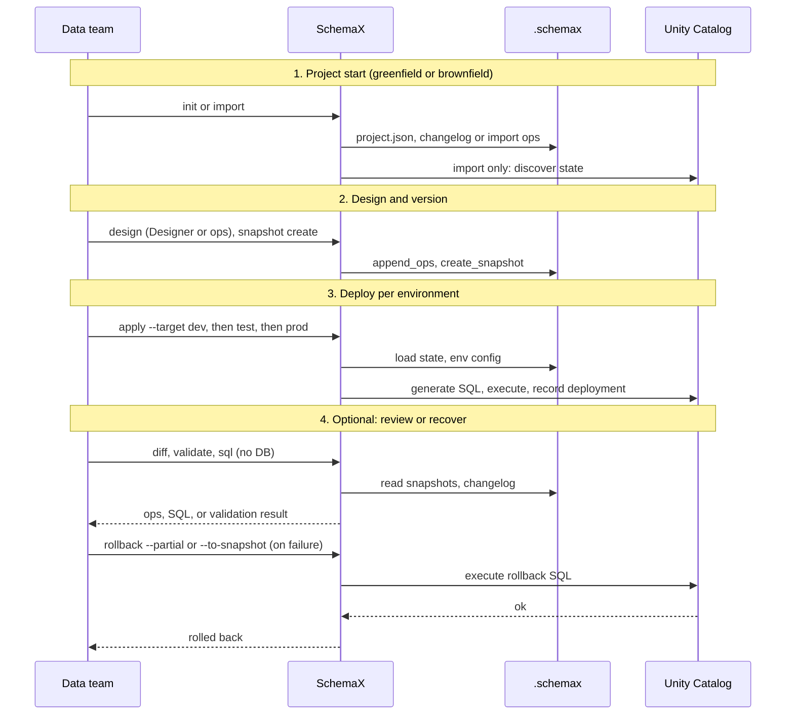

# Workflows (apply and rollback)

SchemaX fits in the **schema layer** of data projects: one repo = one schema project, with environments (dev, test, prod). This doc describes **end-to-end situations**: greenfield, brownfield, apply failure and rollback, and SQL-only/validate.

## Data projects and where SchemaX fits

In data or analytics projects, the typical flow is:

1. **Ingestion** — Raw data lands (batch/stream) into cloud storage or a lake.
2. **Transformation** — Pipelines (e.g. dbt, Spark, Databricks jobs) clean and model data.
3. **Schema / storage** — Catalogs, schemas, and tables define where and how data is stored and who can access it (Unity Catalog, Hive, etc.).
4. **Consumption** — BI, ML, or apps query the tables.

**SchemaX sits in step 3.** It version-controls and deploys the **schema layer** (catalogs, schemas, tables, views, constraints, row filters, column masks) so that:

- Schema changes are declarative, reviewed in Git, and applied in order (dev → test → prod).
- Rollback and diff are possible when something goes wrong or when comparing environments.
- Existing catalogs created outside SchemaX can be **imported** and then managed going forward.

The rest of this doc describes the **five situations** (greenfield single-dev, greenfield multi-dev, brownfield import, apply failure and rollback, and diff/validate/SQL-only) as **sequence diagrams** and tables, so you can see exactly who does what and when.

---

## Scope: One Project, One Schema Definition

- **One data project** = one `.schemax/` directory (one `project.json`, one changelog, one snapshot chain). Usually one repo per analytics domain or product.
- **Environments** = dev, test, prod with per-environment catalog mappings (e.g. logical `__implicit__` → physical `dev_myapp`, `prod_myapp`).
- **Single vs multi-dev** = same repo; multiple data engineers or analysts work on the same schema via Git (branches, merge, rebase). SchemaX does not manage multiple tenants or org-wide catalogs.

---

## Situation 1: Greenfield (New Data Project) — Single Developer

**Context:** New analytics or data project; no schema in the catalog yet. One person owns schema design and deploy.

| Phase   | What happens | Commands / UI |
|--------|---------------|----------------|
| **Start** | No schema; new repo or new data project folder. | — |
| **Init** | Create `.schemax/` with project.json, empty changelog, dev/test/prod env config (catalogMappings). | `schemax init` or VS Code + first “Open Designer”. |
| **Design** | Add catalogs, schemas, tables, columns, constraints, etc. | VS Code Designer (emits ops to changelog) or manual ops. |
| **Checkpoint** | Create first snapshot (e.g. v0.1.0). Changelog cleared, state in snapshot. | `schemax snapshot create` or extension. |
| **Deploy dev** | Generate SQL from changelog/snapshot, apply to dev. | `schemax apply --target dev --profile … --warehouse-id …` (optionally `--dry-run`). |
| **Promote** | Apply same or newer snapshot to test, then prod. | `schemax apply --target test …`, then `--target prod …`. |

**Timeline:** Init → Ops → Snapshot → Apply (dev → test → prod). Single developer owns the schema layer.

---

## Situation 2: Greenfield — Multi-Developer (Same Data Project, Shared Repo)

**Context:** Same data project; several people change schema (branches, merge, or rebase). Validate and snapshot rebase keep the chain consistent.

| Phase   | What happens | Commands / UI |
|--------|---------------|----------------|
| **Parallel work** | Dev A and Dev B: branch, add ops, snapshot, apply to dev. | Designer + `schemax snapshot create` + `schemax apply --target dev`. |
| **Merge** | Merge Git branches. Conflicts possible in `project.json` / `changelog.json` / snapshots. | Git merge; resolve conflicts in JSON. |
| **Validate** | Check project files, snapshot chain, dependency graph. | `schemax validate`; `schemax snapshot validate` (lists stale). |
| **Rebase** | After Git rebase, snapshot chain may be broken. Replay snapshot onto new base. | `schemax snapshot rebase <version>`. Fix conflicts if any. |

**Timeline:** Same as single-dev, plus **Validate** after merge/rebase and **Snapshot rebase** when the chain is broken.

---

## Situation 3: Brownfield (Existing Catalog in Databricks) — Import Then Normal Flow

**Context:** Catalog/schemas/tables already exist (e.g. created manually or by another tool). Data team wants to bring them under SchemaX and then manage changes via snapshot/apply.

| Phase   | What happens | Commands / UI |
|--------|---------------|----------------|
| **Start** | Catalog/schemas/tables already exist in Databricks. Repo may be new or existing. | — |
| **Init (optional)** | If no project yet: `schemax init`. | `schemax init` |
| **Import** | Discover live state from provider; diff vs local; generate ops into changelog. | `schemax import --target dev --profile … --warehouse-id … --catalog <name>` (optionally `--dry-run`). |
| **Import from SQL file** | Parse a DDL file and diff vs local (or replace as new baseline); no Databricks connection. | `schemax import --from-sql path/to/schema.sql [--mode diff\|replace] [--dry-run]`. See [CLI Reference — Import from SQL file](/reference/cli#import-from-sql-file). |
| **Adopt baseline (optional)** | Mark imported state as first deployed for that env: create snapshot, record deployment baseline. | `schemax import … --adopt-baseline` |
| **From here** | Same as greenfield: design (more ops) → snapshot → apply to dev/test/prod. | Same as Situation 1. |

**Timeline:** Init (if needed) → **Import** → (optional) **Adopt baseline** → then **Design → Snapshot → Apply** like greenfield.

### Rollback to before baseline (brownfield)

After **adopt-baseline**, the imported snapshot (e.g. v0.1.0) is the **deployment baseline** for that environment: it represents the first state SchemaX considers “deployed” for that env. Snapshots older than the baseline (if any exist in the chain) are either pre-import or from a different history.

**Scenario:** Someone runs `schemax rollback --target prod --to-snapshot v0.0.5` and the baseline for prod is v0.1.0 (the imported snapshot). So v0.0.5 is **before** the baseline.

**Why it’s risky:**

- Rolling back to a snapshot **before** the baseline would undo the imported state (catalogs/schemas/tables that were brought in by import). The live catalog would no longer match any snapshot that SchemaX “owns.”
- The project’s notion of “current state” and the actual DB would diverge; future applies could recreate objects that were just dropped, or assume objects that no longer exist.
- In brownfield, the baseline is the agreed “first version” under SchemaX; going before it is equivalent to abandoning that agreement for that env.

**Recommended behavior:**

1. **Block by default**  
   If the user requests a rollback to a snapshot **older than** the recorded baseline for that environment, the CLI should **fail with a clear error** and not run any rollback SQL. Example message:
   - *"Rollback to v0.0.5 is before the import baseline for this environment (v0.1.0). Rolling back past the baseline would undo the imported state and is not allowed. Use --force to override (see docs)."*

2. **Explicit override for rare cases**  
   Provide a flag (e.g. `--force`) so that teams can intentionally roll back past the baseline when they really need to (e.g. decommissioning an env or fixing a bad import). When `--force` is set:
   - **Warn** clearly that this undoes the imported state and can leave the project and DB out of sync.
   - Require **confirmation** (interactive prompt or e.g. `--yes`) before executing rollback SQL.
   - Optionally **log** the action (who, when, target snapshot, env) for audit.

3. **Store baseline per environment**  
   To enforce the above, the project (or provider-specific deployment tracking) must record which snapshot is the **import baseline** for each environment (e.g. in `project.json` under `provider.environments.<env>.importBaselineSnapshot` or via the deployment that `adopt_import_baseline` created). Rollback logic then compares `--to-snapshot` to that baseline (using version order or snapshot chain) and blocks or warns accordingly.

**Best practice:**

- **Treat the import baseline as the floor for rollback** for that env. Normal rollback targets should be snapshots **at or after** the baseline (e.g. v0.1.0, v0.2.0), not before.
- **Document** which snapshot is the baseline per environment (in README or runbook) so the team knows the “oldest” safe rollback target.
- Use **complete rollback** to the baseline (e.g. `--to-snapshot v0.1.0`) when you want to revert the env to the imported state; use **partial rollback** only for undoing a failed apply, not for going before baseline.
- Reserve **`--force`** for exceptional cases (e.g. re-import from scratch, decommissioning); use it rarely and with explicit confirmation.

| Behavior | When | Action |
|----------|--------|--------|
| Rollback to snapshot **at or after** baseline | Normal (e.g. revert prod to v0.2.0, baseline is v0.1.0) | Allow; generate and execute rollback SQL as today. |
| Rollback to snapshot **before** baseline | User runs `rollback --to-snapshot v0.0.5`, baseline is v0.1.0 | **Block** with error; suggest valid targets or `--force`. |
| Rollback before baseline with override | User passes `--force` (and e.g. `--yes`) | **Warn** + confirm, then proceed; optionally log for audit. |

---

## Situation 4: Apply Failure and Rollback (Any Environment)

**Context:** Apply runs in prod (or any env); one statement fails. Deployment is partial. Data ops need to undo only the failed run (partial) or revert the env to a previous snapshot (complete).

| Phase   | What happens | Commands / UI |
|--------|---------------|----------------|
| **Apply** | Apply runs N statements; one fails (e.g. statement 3 of 5). | `schemax apply --target prod …` |
| **State** | Deployment recorded as partial/failed; first 2 statements applied. | DB + `project.json` deployments. |
| **Partial rollback** | Undo only the successful operations from that deployment. | `schemax rollback --deployment <id> --partial --target prod …` (or `--dry-run`). |
| **Complete rollback** | Revert environment to a previous snapshot (e.g. v0.1.0). | `schemax rollback --target prod --to-snapshot v0.1.0 …` |

**Timeline:** Apply (failure) → **Partial rollback** or **Complete rollback** → fix schema/ops → Snapshot → Apply again. Auto-rollback on failure: `schemax apply --auto-rollback`.

---

## Situation 5: Diff, Validate, SQL-Only (No Live DB Required)

**Context:** Review changes, validate project health, or generate migration SQL for CI or manual run. No connection to Databricks needed for these commands.

| Use case | What it does | Command |
|----------|----------------|--------|
| **Diff** | Compare two snapshot versions; show ops or SQL to go from one to the other. | `schemax diff --from-version v0.1.0 --to-version v0.2.0` (optional `--target`). |
| **Validate** | Check project files, snapshot chain, dependency graph (e.g. circular refs). | `schemax validate` |
| **SQL only** | Generate migration SQL from changelog or snapshot without applying. | `schemax sql --output migration.sql` (optional `--target`, `--from-version`). |

These fit at any point: after snapshot create, before apply, or in CI for review.

---

## High-Level Data Ops Flow (Where SchemaX Fits)

End-to-end flow for a **data project**: from no schema to deployed and recoverable. SchemaX covers the “Schema / storage” and “Deploy / rollback” steps.

---

## Environment Matrix (Per Data Project)

SchemaX supports multiple **environments** per project (e.g. dev, test, prod). Each environment has:

- **Catalog mapping**: logical catalog name → physical catalog name (e.g. `__implicit__` → `dev_myapp`).
- **Config**: allowDrift, requireSnapshot, autoCreateTopLevel, etc.
- **Deployment scope**: managed categories (e.g. governance-only) and existing objects (e.g. catalogs that already exist). See [Environments and deployment scope](/guide/environments-and-scope).

| Dimension | Single dev | Multi-dev |
|-----------|------------|-----------|
| **Environments** | Same project targets dev, test, prod (separate apply per target). | Same; team shares same `project.json` env config. |
| **Who applies** | One person typically applies to dev; same or CI to test/prod. | Often: devs apply to dev; CI or lead applies to test/prod. |
| **Rollback** | Per-environment: partial (by deployment id) or complete (by snapshot version). | Same; rollback is per target env. |

---

## Summary: End-to-End by Scenario

1. **Greenfield + single dev:**  
   Init → Ops → Snapshot → Apply (dev → test → prod). Optional: Diff, Validate, SQL-only.

2. **Greenfield + multi-dev:**  
   Same; add Validate after merge, Snapshot rebase when chain breaks after rebase.

3. **Brownfield:**  
   Init (if needed) → Import → (optional) Adopt baseline → then same as greenfield (Ops → Snapshot → Apply).

4. **After apply failure:**  
   Partial rollback (undo failed deployment) or complete rollback (to previous snapshot); then fix and re-apply.

5. **Ongoing:**  
   Diff (between versions), Validate (project health), SQL (generate only). No live DB needed.

---

## Note: Import Baseline and Rollback (Implemented)

When you use **import with adopt-baseline**, SchemaX records the imported snapshot as the deployment baseline for that environment.

**Implemented behavior:**

- **Previous snapshots** are **not** deleted; they remain in `.schemax/snapshots/` and in `project.json`.
- The baseline snapshot version is stored per environment in `project.json` under `provider.environments.<env>.importBaselineSnapshot`.
- **Rollback** to a snapshot **older than** the import baseline is **blocked by default**. The CLI fails with a clear error and suggests using `--force` to override (see [Rollback to before baseline (brownfield)](#rollback-to-before-baseline-brownfield)).
- With **`--force`**, rollback before the baseline is allowed: the CLI prints a warning that this undoes the imported state and may leave project and DB out of sync, then (unless `--no-interaction`) prompts for confirmation before proceeding.

**Best practice:** See **[Situation 3: Rollback to before baseline (brownfield)](#rollback-to-before-baseline-brownfield)** above. Treat the import baseline as the floor for rollback; use `--force` only for exceptional cases (e.g. re-import from scratch, decommissioning).
